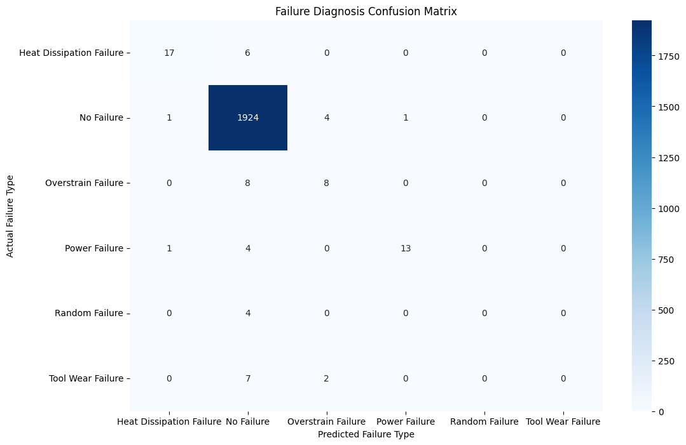

# AI-Driven Predictive Maintenance System 🛠️

### 🚀 Project Overview
This project implements a machine learning solution for **Condition Monitoring** and **Predictive Maintenance**. By analyzing sensor data (Air Temperature, Process Temperature, Torque, RPM), the system detects potential machine failures and diagnoses the specific root cause of the defect (e.g., Power Failure vs. Heat Dissipation Failure).

This project demonstrates the application of **Artificial Intelligence** in **Mechanical Engineering** to minimize downtime and optimize industrial systems.

---

### 📊 Key Results

| Metric | Result | Description |
| :--- | :--- | :--- |
| **Binary Detection Accuracy** | **98.15%** | Accuracy in distinguishing between "Healthy" and "Failing" machines. |
| **Precision (Failure)** | **0.88** | High reliability in flagging failures (low false alarm rate). |
| **Diagnostics Capability** | **F1: 0.81** | Successfully isolates **Power Failures** and **Heat Dissipation Failures**. |

#### 📉 Visualization
*The Confusion Matrix below demonstrates the model's ability to correctly classify specific failure modes despite the highly imbalanced dataset.*




---

### 📂 Dataset
**Source:** [AI4I 2020 Predictive Maintenance Dataset (UCI Machine Learning Repository)](https://archive.ics.uci.edu/dataset/601/ai4i+2020+predictive+maintenance+dataset)

The dataset consists of 10,000 data points collected from a simulated milling machine, containing:
* **Features:** Air temperature [K], Process temperature [K], Rotational speed [rpm], Torque [Nm], Tool wear [min].
* **Targets:** Machine failure (Binary), Failure Type (Multi-class: TWF, HDF, PWF, OSF, RNF).

---

### ⚙️ Methodology

#### 1. Data Preprocessing
* **Feature Selection:** Removed non-predictive identifiers (UDI, Product ID) to prevent data leakage.
* **Target Engineering:** Created a consolidated `Failure_Type` variable for multi-class diagnostics.

#### 2. Model Architecture
* **Algorithm:** Random Forest Classifier (Ensemble Learning).
* **Class Imbalance Handling:** Implemented `class_weight='balanced'` to penalize the model for missing rare failure events (vital for industrial data where failures are <4%).

#### 3. Diagnostics Extension
* Extended the system from simple binary detection to a **multi-class classification system** capable of identifying:
    * Power Failure (PWF)
    * Heat Dissipation Failure (HDF)
    * Overstrain Failure (OSF)
    * Tool Wear Failure (TWF)

---

### 💻 Technologies Used
* **Language:** Python 3.x
* **Data Processing:** Pandas, NumPy
* **Machine Learning:** Scikit-Learn (RandomForestClassifier, LogicsticRegression)
* **Visualization:** Matplotlib, Seaborn

### 🔧 How to Run
1.  Clone the repository:
    ```bash
    git clone [https://github.com/SaiPatil509/EngineFailureAnalysisAI.git]
    ```
2.  Install dependencies:
    ```bash
    pip install pandas numpy scikit-learn matplotlib seaborn
    ```
3.  Run the python file  `enginefailureanalysisai.py`.

---

### 📬 Contact
**Sai Patil**
* Mechanical Engineering Student | AI & Mechanical Enthusiast
* [LinkedIn Profile](www.linkedin.com/in/sai-patil-39027a340)
